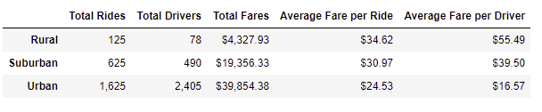
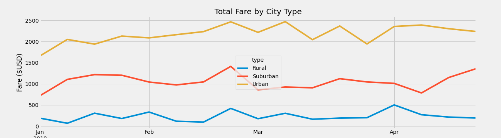

# PyBer_Analysis

## Overview of the analysis: Explain the purpose of the new analysis.

- The analysis aims to create a ride-sharing data’s summary DataFrame by city type including Total Rides, Total Drivers, Total Fares, Average Fare per Ride, and Average Fare per Driver. Then, the report will show the total fares by each city type for each week and visualize it by creating a line graph using Matplotlib.

## Results: 

- From the table, the urban areas show the highest numbers in most of the categories. People living in the city need more rides for some purposes such as doing business or moving between two destinations which is far from each other. Therefore, the demand of urban residents to use this service might be higher than the other two areas. It leads to the higher supply, so the number of drivers and the total fares are high as well. Thus, the price of each fare is lower. 

- In contrast, the rural area has small numbers of rides and drivers showing that people living in these areas consider this service is unessential. Therefore, the number of total fares of this area is the lowest one. It leads to the increase in the price of each fare. 

- Moreover, the suburban falls in the middle of all categories. So, it might be a potential market for this business

- As can be seen from the line chart, the total fares of urban area remain on top and those from rural one receives lowest numbers while the suburban stays in the middle.

## Summary: 

- The CEO can decrease the price of the fare a little bit or offer some promotion for the rural and suburban area to gain attention from residents. When the fare per driver or driver are decreased, it will become more affordable for low income people, especially in the rural area. 

- One of reasons why people in rural area doesn’t use the service is that it is not advertised publicly to all of the residents. Some of people might not know the existence of PyBer and its service. Therefore, the CEO needs to concentrate on the marketing aspects to raise the awareness of rural residents about company’s service. 

- PyBer is successful in urban areas; however, they can develop more by upgrading the user-interface of their application or increase their customer services for helping customers whenever they need right away. 

